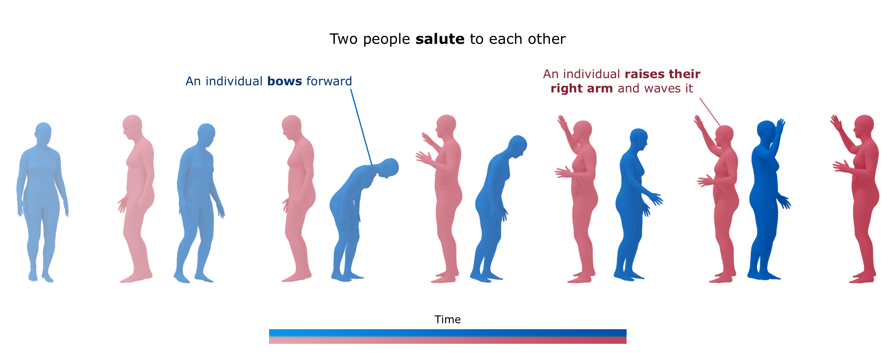

<h1 align="center">in2IN:Leveraging individual Information to Generate Human INteractions</h3>

  <p align="center">
    <a href="https://pabloruizponce.github.io/in2IN/"></a>
    <a href="https://arxiv.org/abs/2404.09988"></a> 
    <a href="https://hits.seeyoufarm.com"></a>
    <a href="https://paperswithcode.com/sota/motion-synthesis-on-interhuman?p=in2in-leveraging-individual-information-to-1"></a>
  </p>

<br>

## 🔎 About
<div style="text-align: center;">
    
</div>
</br>
Generating human-human motion interactions conditioned on textual descriptions is a very useful application in many areas such as robotics, gaming, animation, and the metaverse. Alongside this utility also comes a great difficulty in modeling the highly dimensional inter-personal dynamics. In addition, properly capturing the intra-personal diversity of interactions has a lot of challenges. Current methods generate interactions with limited diversity of intra-person dynamics due to the limitations of the available datasets and conditioning strategies. For this, we introduce <b>in2IN</b>, a novel diffusion model for human-human motion generation which is conditioned not only on the textual description of the overall interaction but also on the individual descriptions of the actions performed by each person involved in the interaction. To train this model, we use a large language model to extend the InterHuman dataset with individual descriptions. As a result, <b>in2IN</b> achieves state-of-the-art performance in the InterHuman dataset. Furthermore, in order to increase the intra-personal diversity on the existing interaction datasets, we propose <b>DualMDM</b>, a model composition technique that combines the motions generated with <b>in2IN</b> and the motions generated by a single-person motion prior pre-trained on HumanML3D. As a result, <b>DualMDM</b> generates motions with higher individual diversity and improves control over the intra-person dynamics while maintaining inter-personal coherence.


## 📌 News
- [2024-06-04] Code, model weights, and additional training data are now available!
- [2024-04-16] Our paper is available on [arXiv](https://arxiv.org/abs/2404.09988)
- [2024-04-06] in2IN is now accepted at CVPR 2024 Workshop [HuMoGen](https://humogen.github.io)!

## 📝 TODO List
- [x] Release code
- [x] Release model weights
- [x] Release individual descriptions from InterHuman dataset.
- [ ] Release visualization code.


## 💻 Usage
### 🛠️ Installation
1. Clone the repo
  ```sh
  git clone https://github.com/pabloruizponce/in2IN.git
  ```
2. Install the requirements
   1. Download the required libraries
      ```sh
      pip install -r requirements.txt
      ```
   2. Install ffmpeg
      ```sh
      sudo apt update
      sudo apt install ffmpeg
      ```

> [!WARNING]  
> All the code has been tested with Ubuntu 22.04.3 LTS x86_64 using Python 3.12.2 and CUDA 12.3.1. If you have any issues, please open and issue.
3. Download the individual descriptions from the InterHuman dataset from [here](https://drive.google.com/drive/folders/14I3_BLu7ItWPNBWN8rMChOZiIkEhXrxH?usp=share_link) and place them in the `data` folder.
> [!IMPORTANT]  
> The original InterHuman dataset is needed to run the code. You can download it from [here](https://github.com/tr3e/InterGen). If you use the dataset, please cite us and the original paper.

### 🕹️ Inference
Download the model weights from [here](https://drive.google.com/drive/folders/14I3_BLu7ItWPNBWN8rMChOZiIkEhXrxH?usp=share_link) and place them in the `checkpoints` folder.

```sh
  python in2in/scripts/infer.py \
      --model configs/models/in2IN.yaml \
      --infer configs/infer.yaml \
      --mode interaction \
      --out results \
      --device 0 \
      --text_interaction "Interaction textual description" \
      --text_individual1 "Individual textual description" \
      --text_individual2 "Individual textual description" \
      --name "output_name" \
```

> [!NOTE]  
> More information about the parameters can be found using the `--help` flag.


### 🏃🏻‍♂️ Training

```sh
  python in2in/scripts/train.py \
      --train configs/train/in2IN.yaml \
      --model configs/models/in2IN.yaml \
      --data configs/datasets.yaml \
      --mode interaction \
      --device 0 \
```

### 🎖️ Evaluation
Download the evaluator model weights from [here](https://drive.google.com/drive/folders/14I3_BLu7ItWPNBWN8rMChOZiIkEhXrxH?usp=share_link) and place them in the `checkpoints` folder.

#### Interaction Quality
```sh
  python in2in/scripts/eval/interhuman.py \
      --model configs/models/in2IN.yaml \
      --evaluator configs/eval.yaml \
      --mode [interaction, dual] \
      --out results \
      --device 0 \
```

#### Individual Diversity
```sh
  python in2in/scripts/eval/DualMDM.py \
      --model configs/models/DualMDM.yaml \
      --evaluator configs/eval.yaml \
      --device 0 \
```

## 📚 Citation

If you find our work helpful, please cite:

```bibtex
@InProceedings{Ruiz-Ponce_2024_CVPR,
    author    = {Ruiz-Ponce, Pablo and Barquero, German and Palmero, Cristina and Escalera, Sergio and Garc{\'\i}a-Rodr{\'\i}guez, Jos\'e},
    title     = {in2IN: Leveraging Individual Information to Generate Human INteractions},
    booktitle = {Proceedings of the IEEE/CVF Conference on Computer Vision and Pattern Recognition (CVPR) Workshops},
    month     = {June},
    year      = {2024},
    pages     = {1941-1951}
}
```

## 🫶🏼 Acknowledgments
- [InterGen](https://github.com/tr3e/InterGen) as we inherit a lot of code from them.
- [MDM](https://github.com/GuyTevet/motion-diffusion-model) as we used their evaluation code for text-motion models.
- [Diffusion Models Beat GANS on Image Synthesis](https://github.com/openai/guided-diffusion) as we used their gaussian diffusion code as a base for our implementation.
